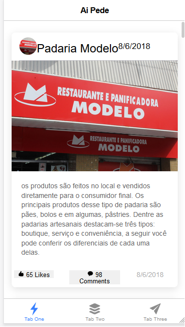
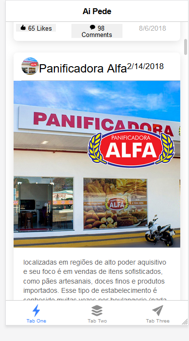

# projeto-ai-pede

Aplicativo Ionic/Angular para consultar padarias, visualizar seus produtos e localizar estabelecimentos próximos no mapa.

## Demonstração

### Tela principal



### Tela de localização



## Requisitos

- Node.js 24.19.0
- npm 11.17.0
- Chrome para executar os testes Karma
- Java/JDK e Android SDK para gerar o aplicativo Android

## Instalação

Na raiz do projeto:

```bash
npm install
npm start
```

O aplicativo ficará disponível em `http://localhost:4200`.

## Backend de autenticação

O backend de demonstração usa Express, SQLite, bcrypt e JWT. Em outro terminal:

```powershell
cd express-auth-demo
npm install
$env:JWT_SECRET = "substitua-por-uma-chave-segura"
npm start
```

O servidor inicia em `http://localhost:3000`.

Para testar em um celular, substitua o endereço local configurado no serviço de autenticação pelo IP da máquina na rede local. `localhost` no celular aponta para o próprio celular.

## Funcionalidades do MVP

- Cadastro e login de usuário.
- Listagem de padarias consumida por API.
- Detalhamento do menu de uma padaria.
- Mapa com localização atual e estabelecimentos cadastrados.
- Tratamento visual de carregamento, erro e lista vazia.
- Build web e build Android via Cordova.

## Comandos úteis

```bash
npm run lint
npm run build
npm test -- --watch=false --browsers=ChromeHeadless
npm run cordova:build
```

O build Android exige `JAVA_HOME`, Android SDK e plataforma Android 36 instalados.

## Organização

- `src/app/auth`: cadastro, login, sessão e armazenamento do token.
- `src/app/services`: acesso às APIs de padarias.
- `src/app/tab1`: listagem principal.
- `src/app/bakery-detail`: produtos da padaria selecionada.
- `src/app/location`: mapa e geolocalização.
- `express-auth-demo`: servidor local de autenticação.

## Observações

- O mapa depende da API JavaScript do Google Maps e de uma chave válida, restrita por domínio/app.
- A API pública de padarias é externa e pode ficar indisponível.
- O backend é didático e não deve ser usado em produção sem HTTPS, rate limiting, configuração de CORS e gerenciamento seguro de segredos.
- Os testes compilam com o projeto, mas precisam de Chrome instalado para executar em modo headless.
